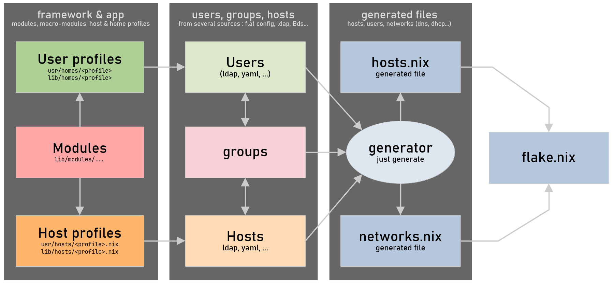

{/* t:main */}
{/* t:h e625ed52cc85b84bed31ab785d4eb0fdcde3e34cea72d78d5380267cbd95a287 */}

import { Steps } from '@astrojs/starlight/components';

{/* t:p 9ef73223a4d8aa7648c76e5a9a17a2fb16646af264f28994fa2a699d91f074c4 */}
## Goals

This nixos configuration enables a full local network with ready-to-use configurations and profiles:

- **User profiles** contain features and configurations for users (employees, developers, administrators, kids...).
- **Host profiles** cover standard use cases: workstations, servers, network nodes (gateway).

:::note[Universal settings]
Configurations are designed to be fully functional, clean, consistent, easy to use, and require no extensive customization.
:::

:::tip[Use cases]
For example, this configuration can be used for:

- **Work**: A network with a gateway, servers, and workstations.
- **Family**: Gateway with adguard and host profiles tailored for parents and kids.
- **Projects**: Servers and workstations designed to meet your specific needs.
:::

{/* t:p ce6bf141cd4345c8d5714e6c22a1dc8ba546cb6540f32d8242d5f092738b1e88 */}
## Implemented features

This section includes everything that is currently implemented and functional.

{/* t:p 4a8d95ff9a92ad453f513eec6ad684ff1981e6d6da6ac08805cec2fe169e2d66 */}
### The generator

Its role is to generate a pure static configuration from a definition of machines (hosts), users, and groups from various sources (static declarations, LDAP, etc. configured in [`usr/config.yaml`](#the-configuration-file). The generated Nix configuration is integrated into the repository to be fixed and used by the flake.



Usage:

```shell
# Generate, fix, format, check
just clean
```

A `just clean`:

```shell
❯ just clean
-> Fixing source code with statix...
-> Checking nix files with deadnix...
-> generating dnf/modules/nix default.nix...
-> generating usr/modules/nix default.nix...
-> generating dnf/modules/home default.nix...
-> generating usr/modules/home default.nix...
-> generating users in var/generated/users.nix...
-> generating hosts in var/generated/hosts.nix...
-> generating network in var/generated/network.nix...
-> Formatting nix files with nixfmt...
```

:::note[The generated files]
- `var/generated/disko` Hosts to install
- `var/generated/hosts.nix` The host collection
- `var/generated/users.nix` The explicitly created user collection
- `var/generated/network.nix` The network configuration
:::

{/* t:p 22662da7ca9622fe0d84d27cce9d4ab06d6c9fc616b181dec8822ca1573d99e8 */}
### The configuration file

The `usr/config.yaml` file contains declarations of users, hosts and network config. [The generator](#the-generator) reads this file to create a static pure nix configuration.

:::note[Users - groups - hosts]
You can link users and hosts either directly or through a group list, which is declared in the users and/or groups items.
:::

Content accessible in your nix configuration:

- `network` attrSet contains useful content to build a gateway and more.
- `users` attrSet is a full list of users.
- `hosts` list is a full list of hosts.
- `host` contains the current host informations.

:::tip
The framework repository contains an example:

- [`usr/config.yaml`](https://github.com/darkone-linux/darkone-nixos-framework/blob/main/usr/config.yaml) main config file generates...
- [`var/generated/users.nix`](https://github.com/darkone-linux/darkone-nixos-framework/blob/main/var/generated/users.nix) attrSet (accessible through `users`) and...
- [`var/generated/hosts.nix`](https://github.com/darkone-linux/darkone-nixos-framework/blob/main/var/generated/hosts.nix) list (accessible through `hosts` and `host`) and...
- [`var/generated/network.nix`](https://github.com/darkone-linux/darkone-nixos-framework/blob/main/var/generated/network.nix) attrSet (accessible through `network`).

Usage examples:

- [`service/dnsmasq.nix`](https://github.com/darkone-linux/darkone-nixos-framework/blob/main/dnf/modules/nix/standard/service/dnsmasq.nix) module uses `network` to create a full-featured gateway.
- [`user/build.nix`](https://github.com/darkone-linux/darkone-nixos-framework/blob/main/dnf/modules/nix/standard/user/build.nix) module creates some users with `users` and current `host`.
- [`service/ncps.nix`](https://github.com/darkone-linux/darkone-nixos-framework/blob/main/dnf/modules/nix/standard/service/ncps.nix) module uses `host` and `network` to declare server and clients.
:::

{/* t:p 664449c499dfa49d1bebd8746ab649d5ee229c57483cf5b141a04a5753a1898e */}
### Network declaration example

Minimal network:

```yaml
# usr/config.yaml
# Global network configuration is converted in lists / attSets to be used in
# your nix configuration through "network" special arg.
network:
  domain: "darkone.lan"
  gateway:
    hostname: "gateway"
    wan:
      interface: "eth0"
    lan:
      interfaces: ["enu1u4"]
```

Example with more options:

```yaml
# usr/config.yaml
network:
  domain: "darkone.lan"
  timezone: "America/Miquelon"
  locale: "fr_FR.UTF-8"
  gateway:
    hostname: "gateway"
    wan:
      interface: "eth0"
    lan:
      interfaces: ["enu1u4", "wlan0"]
      ip: "192.168.1.1"
      prefixLength: 24
      dhcp-range:
        - "192.168.1.100,192.168.1.230,24h"
      dhcp-extra-option:
        - "option:ntp-server,191.168.1.1"
  extraHosts:
    "192.168.0.1": ["box"]
```

{/* t:p 19edd0db4d64e89f2e424d30c937218249451af90a14fd5d6711b428d779fbff */}
#### Users' declaration example

```yaml
# usr/config.yaml
# Static users
# -> profile is the HomeManager profile
# -> groups is used to select related hosts
users:

  # A nix administrator
  darkone:
    uid: 1000
    name: "Darkone Linux"
    email: "darkone@darkone.yt"
    profile: "nix-admin" # built-in profil for nix administrators
    groups: ["admin", "common"]

  # A student with specific profile "student"
  alice:
    uid: 1002
    name: "Alice"
    profile: "student"
    groups: ["school"]

  # A child of my home network
  john:
    uid: 1003
    name: "John"
    profile: "teenager"
    groups: [ "kids", "common" ]
```

{/* t:p 101d7b81eb3d61d549633b33eb7366a8be92b51bbcb5fc03871ab3b214f2102e */}
#### Hosts' declaration example

```yaml
# usr/config.yaml
# Hosts declaration
# -> name: human readable name or description
# -> profile: the host profile related to this host
# -> users: a list of existing user logins
# -> groups: used to select related users
# -> tags: added to colmena tags for deployment filtering
# -> local: true is only for the local (master) machine
# -> arch: the host architecture, default is x86_64-linux
# -> disko: disks description for an auto-install with disko (only for install)
# -> interfaces: list of ips + mac addresses (fixed adresses)
# -> services: enabled DNF services on this hosts
hosts:

  # Static hosts
  static:

    # The gateway
    - hostname: "gateway"
      name: "Local Gateway"
      arch: "aarch64-linux"
      profile: "gateway"
      groups: ["admin"]
      aliases: ["gateway", "gw"]

    # A laptop
    - hostname: "my-laptop"
      name: "My Laptop"
      profile: "laptop"
      users: ["nixos"]
      groups: ["admin", "common"]
      tags: ["laptops", "admin"]
      aliases: ["my-laptop", "darkone"] # Host name aliases
      interfaces:
        - mac: "e8:ff:1e:d0:44:82"
          ip: "192.168.1.2"
        - mac: "e8:ff:1e:d0:44:83"
          ip: "192.168.1.82"

  # Host groups by range (generated from min to max)
  range:

    # 4 workstations based on the profile "workstation"
    - hostname: "pc%'02s"
      name: "Workstation %d"
      profile: "workstation"
      range: [1, 4]
      groups: ["tsn", "sn"]
      hosts:
        1:
          interfaces:
            - mac: "08:00:27:03:BB:20"
              ip: "192.168.1.101"
        2:
          interfaces:
            - mac: "08:00:27:AE:49:7F"
              ip: "192.168.1.102"
        3:
          interfaces:
            - mac: "08:00:27:EA:85:CB"
              ip: "192.168.1.103"
        4:
          interfaces:
            - mac: "08:00:27:A4:B1:36"
              ip: "192.168.1.104"

  # List of similar hosts (each item is a host)
  list:

    # 2 similar hosts (for the default network)
    - hostname: "laptop-%s"
      name: "Laptop %s"
      profile: "home-laptop"
      groups: ["common"]
      users: ["darkone"]
      hosts:
        kids:
          name: "Kids"
          interfaces:
            - mac: "f0:1f:af:13:61:c6"
              ip: "192.168.1.20"
        family:
          name: "Kids"
          interfaces:
            - mac: "f0:1f:af:13:61:c7"
              ip: "192.168.1.21"
```

{/* t:p 3ee286ca2867cb4005526ad18b5e6fc9e8215aa7ba09bf64d21538d5136fb868 */}
### Create a host profile (example)

How to create your own host profile for your local network, based on "desktop" host profile from DNF.

<Steps>

1. Configuring a module for a ready-to-use "workstation" template

    ```nix
    # usr/modules/host/workstation.nix
    { lib, config, ... }:
    let
      cfg = config.darkone.host.workstation;
    in
    {
      # A simple .enable declaration for my module
      options = {
        darkone.host.workstation.enable = lib.mkEnableOption "Local workstation host profile";
      };

      # If this module is enabled
      config = lib.mkIf cfg.enable {

        # Activate all the necessary to have an office PC
        darkone.host.desktop.enable = true;
      };
    }
    ```

    :::note
    - There are also pre-configured host profiles in `dnf/modules/host`.
    - Users linked to the host are declared via `users` and/or `groups`.
    - Users and groups can be declared in [the configuration](#the-configuration-file) or in LDAP.
    :::

2. Now, let's create a workstation host

    ```yaml
    # usr/config.yaml
    hosts:
      static:
        - hostname: "my-pc"
          name: "A PC"
          profile: workstation
          users: [ "darkone", "john" ]
          disko: # Disko profile
            profile: "luks-btrfs-1-disk"
    ```

</Steps>

:::tip
To install a new machine :

- configure the disko profile
- load a [minimal nixos image](https://nixos.org/download/)
- set a password for nixos with `passwd`
- run `ip a` to get the ip address

```sh
# New host full installation
just full-install pc01 nixos 192.168.1.234
```

To update hosts:

```sh
# Update the host pc01
just apply pc01

# Applying all hosts with the tag "desktop"
just apply @desktop

# Applying all hosts used by the user "darkone"
just apply @user-darkone
```
:::

{/* t:p 7839cf7f4315eb528137323ad344e1938b05b6ab7c952dc0daf1dfe137c380bf */}
### Create a user profile (example)

:::note
There are already [pre-made user profiles](https://github.com/darkone-linux/darkone-nixos-framework/tree/main/dnf/home/profiles), this operation is optional.
:::

Each user have a **profile declaration** in the nix configuration and a **home profile** used by home manager. For example:

- `dnf/home/profiles/admin.nix` contains the nixos `users.users.` declaration.
- `dnf/home/profiles/admin/` contains the home manager files for this profile.

<Steps>

1. User creation in the nix general configuration

    ```nix
    # usr/home/profiles/sn-user.nix
    # A student
    { pkgs, lib, config, ... }:
    { initialPassword = "changeme"; }
    // import ./../../../../dnf/home/profiles/student.nix { inherit pkgs lib config; }
    ```

2. Home manager profile

    ```nix
    # usr/home/profiles/sn-user/default.nix
    { pkgs, ... }:
    {
      imports = [ ./../../../../../dnf/home/profiles/student ];
      home.packages = with pkgs; [
        hunspell
        hunspellDicts.fr-moderne
        libreoffice-fresh
        obsidian
      ];
      home.stateVersion = "25.05";
    }
    ```

</Steps>

{/*

{/* t:p 433eaa7e8a93d5151e9390cca2d8e8b42188d5d824e366bedede829eb4c0dbc6 */}
## Work in progress features

:::caution
These examples are not yet fully functional and may differ in the future stable version of the project.
:::

{/* t:p 874da00fcd4a0cebef6fa315908c747f7c2f1f28ce9709e610d93efae71459e1 */}
### A full-featured gateway (example)

Minimal host profile declaration:

```nix
# usr/modules/host/server-gateway.nix

{ lib, config, ... }:
let
  cfg = config.darkone.host.server-gateway;
in
{
  options = {
    darkone.host.server-gateway.enable = lib.mkEnableOption "My gateway host profile";
  };

  config = lib.mkIf cfg.enable {
    darkone.host.gateway = {
      enable = true;
      wan.interface = "eth0";
      lan.interfaces = [ "eth1" "eth2" ];
    };
  };
}
```

A more complete version:

```nix
# usr/modules/host/server-gateway.nix
{
  # ...
  darkone.host.gateway = {
    enable = true;
    wan = {
      interface = "eth0";
    };
    lan = {
      interfaces = [ "wlan0" "enu1u4" ]; # wlan must be an AP
      bridgeIp = "192.168.1.1";
      domain = "arthur.lan"; # optional (default is <hostname>.lan)
      dhcp = { # optional
        enable = true;
        range = "192.168.1.100,192.168.1.230,24h";
        hosts = [
          "e8:ff:1e:d0:44:82,192.168.1.2,darkone,infinite"
          "f0:1f:af:13:62:a5,192.168.1.3,laptop,infinite"
        ];
        extraOptions = [
          "option:ntp-server,191.168.1.1"
        ];
      };
      accessPoints = [
        {
          wlan0 = {
            ssid = "Mon AP";
            passphrase = "Un password";
          };
        }
      ];
    };
  };
}
# ...
```

To deploy:

```sh
# Simple and optimal
just apply gateway

# Colmena
colmena apply --on gateway switch
```

*/}

{/* t:p a312636e9e61c46e31526b4e0ec50b7e55e5d3ccb8524fd1ed26915b3948e513 */}
## Features in reflexion

:::danger
Not yet functional at this time.
:::

{/* t:p 889592d0417b57d816b6e7527b939772e7c409c81089d6a81c180ee88e92f12f */}
### K8S installation

Master (minimal working configuration) :

```nix
{
  # Host k8s-master
  darkone.k8s.master = {
    enable = true;
    modules = {
      nextcloud.enable = true;
      forgejo.enable = true;
    };
  };
}
```

Slave (known and authorized because declared in the same DNF configuration):

```nix
{
  # Host k8s-slave-01
  darkone.k8s.slave = {
    enable = true;
    master.hostname = "k8s-master";
  };
}
```

Master with options:

```nix
{
  # Host k8s-master
  darkone.k8s.master = {
    enable = true;
    modules = {
      nextcloud.enable = true;
      forgejo.enable = true;
    };
    preemtibleSlaves = {
      hosts = [ "k8s-node-01" "k8s-node-02" ];
      xen.hypervisors = [
        {
          dom0 = "xenserver-01";
          vmTemplate = "k8s-node";
          minStatic = 3;
          maxPreemptible = 20;
        }
      ];
    };
  };
}
```

{/* t:p 7d9ad1e681e168ecbc342dddc6e3edcffd4721f565920f87920834fbdae69c0d */}
### Introspection commands

```shell
# Host list with resume for each
just host

# Host details : settings, activated modules, user list...
just host my-pc

# User list with resume (name, mail, host count)
just user

# User details : content, feature list, host list...
just user darkone
```
