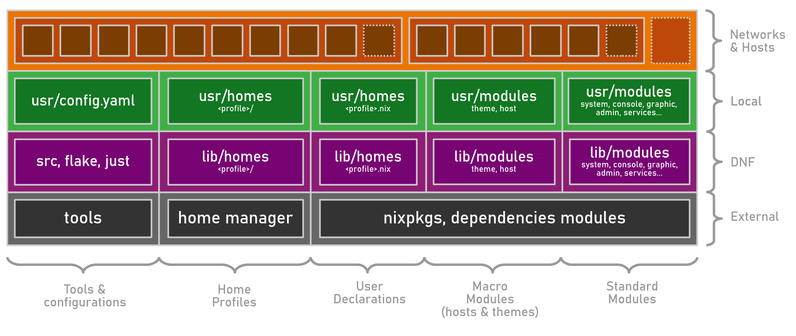

import { FileTree } from '@astrojs/starlight/components';

:::tip[Non informaticien ?]
Le [guide de l'utilisateur](/fr/doc/user-guide/) est pour vous !
:::

Une **configuration NixOS** multi-utilisateur, multi-hôte et multi-service&nbsp;:

- 🔥 [Déclaratif, reproductible, immuable](https://nixos.org/).
- 🚀 [Modules](/fr/ref/modules/) prêts à l’emploi.
- ❄️ [Configuration](https://github.com/darkone-linux/darkone-nixos-framework/blob/main/usr/config.yaml) simple.
- 🧩 [Organisation](/fr/doc/introduction/#structure) cohérente.
- 🌎 Un [réseau complet](#le-réseau-dnf).

:::note
Ce projet évolue en fonction de mes besoins. Si vous souhaitez être informé des prochaines versions stables, merci de me le faire savoir sur [GitHub](https://github.com/darkone-linux/darkone-nixos-framework) ou en vous abonnant à ma [chaîne YouTube](https://www.youtube.com/@DarkoneLinux) (FR). Merci !
:::

## Fonctionnalités principales

| | Fonctionnalité | Description |
|---|---------------|-------------|
| ⚙️ | Tout-automatisé | Avec [nixos-anywhere](https://github.com/nix-community/nixos-anywhere), [disko](https://github.com/nix-community/disko) et [colmena](https://github.com/zhaofengli/colmena) |
| 👤 | Profils utilisateurs | [Profils](https://github.com/darkone-linux/darkone-nixos-framework/tree/main/dnf/home/profiles) et [modules](/fr/ref/modules/#home-manager-modules) [Home Manager](https://github.com/nix-community/home-manager) (admin, gamer…) |
| 🖥️ | Profils d’hôtes | [Profils d’hôtes](/fr/ref/modules/#-darkonehostdesktop) (serveurs, nœuds réseau, postes de travail…) |
| 🌐 | VPN Tailnet | [VPN maillé](https://fr.wikipedia.org/wiki/R%C3%A9seau_maill%C3%A9) avec [headscale](https://headscale.net/) + [tailscale](https://tailscale.com/) + [sous-réseaux](#une-configuration-pour-un-réseau-complet) |
| 🛡️ | Stop Publicités | Internet sécurisé et sans pub avec [AdguardHome](https://adguard.com/fr/adguard-home/overview.html) |
| 🧩 | Identités uniques | SSO avec [Kanidm](https://kanidm.com/) et [Vaultwarden](https://github.com/dani-garcia/vaultwarden) |
| 🤗 | Services intelligents | [Immich](https://immich.app/), [Nextcloud](https://nextcloud.com/), [Forgejo](https://forgejo.org/), [Matrix](https://matrix.com/), [Jellyfin](https://jellyfin.org/), [etc.](/fr/ref/modules/#-darkoneserviceadguardhome) |
| 💻 | GNOME épuré | Hôtes NixOS avec [GNOME](https://www.gnome.org/) et applis pré-configurées |
| 💾 | Sauvegardes 3-2-1 | Sauvegardes [Restic](https://restic.net/) robustes, simplifiées, distribuées |
| 🏠 | Page d’accueil | Page d’accueil automatisée pour chaque zone |

## Sous le capot

| | Spécificité | Description |
|---|---------------|-------------|
| ❄️ | Déclaratif,&nbsp;immuable | Et reproductible grâce à [Nix / NixOS](https://nixos.org/) et son écosystème |
| 🔑 | Sécurité renforcée | Stratégie de sécurité simple et fiable, reposant sur [sops-nix](https://github.com/Mic92/sops-nix) |
| 📦 | Modules complets | [Modules NixOS haut-niveau](/fr/ref/modules/) faciles à configurer |
| 📐 | Architecture | [Cohérente, extensible, scalable, personnalisable](/fr/doc/introduction/#structure) |
| ✴️ | Proxy inverse | Services distribués à travers le réseau via proxies [Caddy](https://github.com/caddyserver/caddy) |
| 🛜 | Réseau automatisé | Plomberie [dnsmasq](https://thekelleys.org.uk/dnsmasq/doc.html) zero-conf (DNS, DHCP, pare-feu…) |

## Le réseau DNF

Cette configuration gère tout le réseau et ses noeuds :

- Les **zones** contenant chacune une passerelle et des machines.
- Le **VPN** qui englobe les zones et d'autres machines sur internet.

On peut résumer le fonctionnement du réseau ainsi :

## Organisation des fichiers

A la racine :

- `dnf` -> modules, users, hosts (framework)
- `usr` -> Projet local (en écriture)
- `var` -> Fichiers générés et logs
- `src` -> Fichiers source du générateur
- `doc` -> Documentation du projet

### Structure

<FileTree collapsed={true}>
- flake.nix Flake du projet
- Justfile Gestion du projet avec [just](https://github.com/casey/just)
- dnf/ Framework (modules & common files)
  - modules/ [Framework modules](/fr/ref/modules/)
    - standard Modules standards
      - system/ Système & Matériel
      - console/ Application CLI
      - graphic/ Applications X
      - service/ Services réseau
      - admin/ Administration
      - user/ Configurations utilisateurs (hors HM)
    - mixin Macro-modules "Mixins"
      - host/ Profiles d'hôtes (desktop, server...)
      - profile/ Compléments aux profils utilisateurs
  - home Configuration Home Manager (HM)
    - modules/ Modules nix (fonctionnalités, programmes)
    - profiles/ Profils : admin, student, advanced...
    - nixos/ Configurations NixOS (hors HM) additionnelles
- **usr/** Configuration spécifique de mon réseau
  - config.yaml [Ma config principale](/en/doc/specifications/#the-configuration-file) (en)
  - modules/ Mes modules NixOS, identique à `dnf/modules`
  - home/ Mes modules HM, identique à `dnf/home`
  - secrets/ Mes mots de passe
    - secret.yaml Mots de passe et clés SOPS
  - machines/ Confs spécifiques par hôte (hardware, etc.)
  - users/ Confs spécifique HM par utilisateur
- var/ Fichiers générés
  - log/ Fichiers de log
  - generated/ [Fichiers générés](/en/doc/specifications/#the-generator) (en)
    - hosts.nix
    - users.nix
    - network.nix
- src/ Sources du générateur
- doc/ Cette documentation
</FileTree>

### Couches d'abstraction

Les niveaux inférieurs rendent service aux niveaux supérieurs.

Ces configurations sont organisées par catégories:

- **[Modules standards](/fr/ref/modules/#standard-modules)** simples et faciles à utiliser.
- **[Modules mixins](/fr/ref/modules/#mixin-modules)** qui englobent plusieurs modules standards.
- **[Profils utilisateur](/en/doc/specifications/#create-a-user-profile-example)** (en), configurations [Home Manager](https://github.com/nix-community/home-manager) standards.
- **Outils pour maintenir une configuration qualitative.

## Utilisation de l'IA

:::tip[Introduction tardive de l'IA]
Jusqu'à fin avril 2026, **le code de ce projet a été entièrement écrit à la main, sans aide de l'IA**.
Parce que l'assistance IA va devenir indispensable pour s'adapter à un nouveau rythme de développement global,
une politique est en cours de mise en place depuis mai 2026, de préférence souveraine et locale.

- Le code "utile" et décisions d'architecture -> **toujours manuel**.
- Partage du projet en plusieurs sous-projets plus petits.
- Code 100% testable et réduction des effets de bords par l'IA.
- Mémoire de projet, ingénérie de contexte, index de code base...
:::
